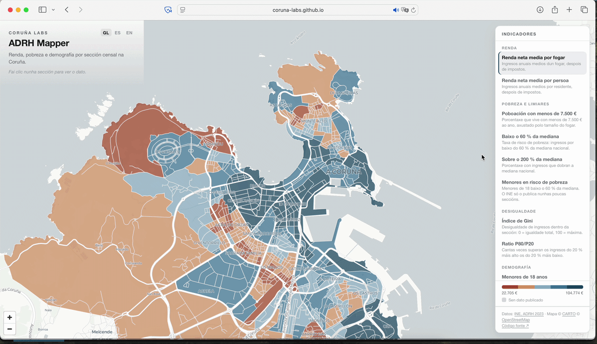

# ADRH Mapper

An open, trilingual map of income, poverty, inequality, and demographics in
A Coruña — one census section at a time.

Every polygon is a *sección censal*, the smallest unit Spain's statistical
office publishes at. Pick an indicator, read the city by color, click any
section for its exact figure.

**Live:** [adrh.cidadelabs.org](https://adrh.cidadelabs.org) ·
**Data:** [INE, Atlas de Distribución de Renta de los Hogares, 2023](https://www.ine.es/dyngs/INEbase/operacion.htm?c=Estadistica_C&cid=1254736177088&menu=resultados&idp=1254735976608)



---

## What it shows

Fifteen indicators, all from a single INE source — the *Atlas de Distribución
de Renta de los Hogares* (ADRH) — grouped into five families:

- **Income** — mean net income per household and per person
- **Poverty & thresholds** — share under €7,500, below 60% of the median,
  above 200% of the median, and children at risk of poverty
- **Inequality** — Gini index and the P80/P20 ratio
- **Demographics** — share under 18 and over 65
- **Income sources** — the share of gross income from salaries, pensions,
  unemployment benefits, other benefits, and other income

Income and inequality use diverging color scales anchored at the city median,
so a section reads as *above or below the A Coruña norm*. Poverty and inequality
indicators run toward red at the worse end — red always means "worse," whatever
the variable. Where INE suppresses a figure for statistical secrecy (too few
residents to publish without identifying them), the section is drawn in neutral
grey and labeled plainly. Nothing is estimated or filled in.

---

## The data pipeline

The map is the visible tip of the work. Most of the effort was upstream, in
**R** — sourcing fifteen raw tables from INE, cleaning Spanish-formatted
numbers, reshaping them to one value per section, and joining them onto census
geometry pulled live from INE's boundary service. That processing and
spatializing step is the real substance of the project, and it's fully
reproducible from the scripts in `R/`.

```
  INE (ine.es)
  ┌─────────────────────────────┐   ┌──────────────────────────────┐
  │  15 statistical tables      │   │  Census section boundaries   │
  │  ADRH 2023, sección censal  │   │  OGC API Features (GeoJSON)  │
  │  → raw/ine_t*.csv (TSV)     │   │  filtered to municipio 15030 │
  └──────────────┬──────────────┘   └───────────────┬──────────────┘
                 │                                   │
        R · dplyr · readr                       R · sf
                 │                                   │
                 ▼                                   │
  ┌─────────────────────────────┐                   │
  │  utils.R  (shared cleaning) │                   │
  │  • filter to A Coruña + year│                   │
  │  • extract 10-digit CUSEC   │                   │
  │  • locale → machine numbers │                   │
  │    (21.293→21293, 58,6→58.6)│                   │
  │  • "." suppressed → NA       │                  │
  │  • drop district roll-up rows│                  │
  └──────────────┬──────────────┘                   │
                 │                                   │
                 ▼                                   │
  ┌─────────────────────────────┐                   │
  │  clean/*_cusec_2023.csv      │                  │
  │  one value per section,      │                  │
  │  keyed on CUSEC              │                   │
  └──────────────┬──────────────┘                   │
                 │                                   │
                 └───────────────┬───────────────────┘
                                 │
                          R · sf · left_join
                          on CUSEC (10-digit)
                                 │
                                 ▼
                  ┌────────────────────────────┐
                  │ data/adrh_cusec_2023.geojson│
                  │ geometry + 15 indicators    │
                  │ (null where suppressed)     │
                  └──────────────┬─────────────┘
                                 │
                                 ▼
                     index.html · MapLibre GL
                     choropleth + trilingual UI
```

### Why R

The pipeline leans on R deliberately. The cleaning is not trivial. INE
publishes its tables in the standard Spanish locale — a comma for the decimal
separator and a period for thousands (`21.293` is twenty-one thousand two
hundred ninety-three; `58,6` is fifty-eight point six) — which is exactly how
they should read for a Spanish audience. Moving those numbers into any
programming language, though, means converting to the machine convention that
R, Python, and the rest expect internally (`.` as decimal), the same step any
analyst hits regardless of country. On top of that, INE uses a literal `.` to
mark values suppressed for statistical secrecy, and mixes district- and
municipality-level roll-up rows in with the sections. `dplyr` and `readr`
handle the filtering and reshaping; a small set of shared functions in
`utils.R` (`extract_cusec`, `fix_spanish_number`, `drop_rollup_rows`) apply the
same corrections identically across all fifteen tables, so the process is
consistent and auditable rather than hand-tuned per file.

The spatial join is done in R too, with **`sf`**. Census geometry is pulled
straight from INE's OGC API Features service, filtered server-side to A Coruña,
reprojected to WGS84 (MapLibre needs it), and joined to the cleaned indicators
on the 10-digit CUSEC code. No desktop GIS step, no manual exports — the whole
path from public source to web-ready GeoJSON runs in R.

### Run it yourself

```
R/
├── utils.R              # shared cleaning + CUSEC helpers
├── clean_adrh_all.R     # all 15 indicators → clean/*.csv
└── build_geojson.R      # pull geometry, join, write data/*.geojson
raw/                     # INE downloads (not tracked — see below)
clean/                   # one tidy CSV per indicator
data/                    # adrh_cusec_2023.geojson (the map reads this)
```

The raw INE tables are **not committed** — the national files exceed GitHub's
size limit, and they're freely re-downloadable from source. To rebuild from
scratch, download the fifteen ADRH tables from the
[Atlas results page](https://www.ine.es/dyngs/INEbase/operacion.htm?c=Estadistica_C&cid=1254736177088&menu=resultados&idp=1254735976608)
(each table's export → CSV), place them in `raw/`, then:

1. `source("R/clean_adrh_all.R")` — writes the fifteen cleaned CSVs to `clean/`.
2. `source("R/build_geojson.R")` — pulls geometry, joins, writes the GeoJSON.
3. Serve the folder (`python3 -m http.server`) and open `index.html`.

The cleaned outputs in `clean/` and the final `data/adrh_cusec_2023.geojson`
*are* committed, so the map runs without re-downloading anything.

---

## On INE's own Atlas viewer

INE already publishes an interactive version of this data — the *Atlas*
experimental viewer, built on Esri's platform. ADRH Mapper covers the same
public figures with an open-source stack instead: MapLibre GL, CARTO basemaps,
and R, served as a plain static site and scoped to A Coruña. The two sit
alongside each other, in the same open, European spirit the data itself comes
from.

---

## Built with

- **[R](https://www.r-project.org/)** with `dplyr`, `readr`, `sf`, `purrr` —
  all data processing and spatializing
- **[MapLibre GL JS](https://maplibre.org/)** — the map renderer (open-source)
- **[CARTO Positron](https://carto.com/basemaps/)** — basemap tiles
- **[INE](https://www.ine.es/)** — the Atlas de Distribución de Renta de los
  Hogares and the census section geometry
- **[Claude](https://www.anthropic.com/)** (Anthropic) — used as a tool to work
  out the pipeline scripts and the map front end

---

## About

ADRH Mapper is a project of [Cidade Labs](https://cidadelabs.org), a small,
independent, non-profit civic-tech lab for Galicia. It works in Galician
(default), Spanish, and English.

Data © INE, reused under its terms. Map © CARTO, © OpenStreetMap contributors.

*Datos, mapas e cidade. Ferramentas cívicas para Galicia.*
